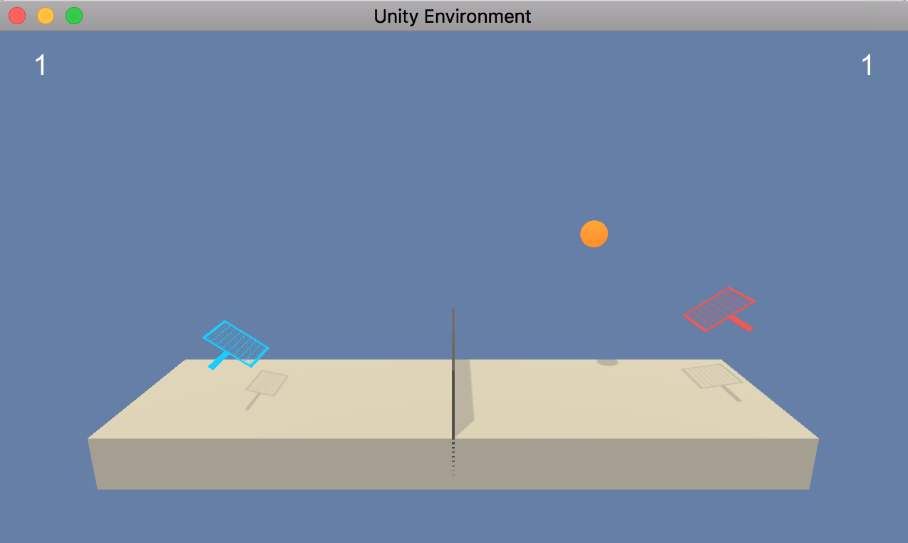

# Project 3: Collaboration and Competition

## 1. Overview
The aim of this project is to train two agents
which play tennis cooperatively.  
The Multi-Agent Deep Deterministic Policy Gradient (MADDPG)
algorithm is implemented for training the multiple agents efficiently.
The repository for this project provided by Udacity is available
[here](https://github.com/udacity/deep-reinforcement-learning/tree/master/p3_collab-compet)

## 2. Environment

For each agent, state, action etc. are defined as follows:
- **State**: The state space of the environment for each agent
is **24**-dimensional. Positions and velocities of the corresponding
player and ball are encoded in a state.
- **Action**:
The action space of the environment for each agent is
**2**-dimensional. Each element takes a continuous value within [-1, 1].
An action encodes whether the corresponding player will move
toward/away from the net and jump at the location of the player.

- **Reward**: At each time step, for each agent,
a reward **+0.1** is provided if the agent hits a ball over the net.
On the other hand, a reward **-0.01** is provided if the agent lets
a ball hit the ground or hits the ball out of bounds.  

The task is episodic. For the measure of the performance, the maximum
value (among the two agents) of the scores (= the sum of rewards over a given episode)
is considered. I use the average value of the maximum score over the last 100 episodes.
The environment is regarded as being solved when the average score becomes
**0.5** or higher.

A captured image example from the simulator for this environment is displayed below:


## 3. Training Algorithm
For training models, I have implemented Multi-Agent Deep Deterministic Policy
Gradient (MADDPG) algorithm.  
For further details, please refer to the report `Report.pdf`
and the references therein.

## 4. Contents of Repository
This repository contains the following files:
- `model.py`: This Python file contains the modules `Actor` and `Critic` which
defines the neural networks for the actor model and critic model (for single agent),
respectively.
- `maddpg.py`: This Python file defines the module
`DDPG` for single DDPG agent and the module `MADDPG` for MADDPG algorithm.
- `utility.py`: This Python file defines
the module `ReplayBuffer` for the normal replay buffer as well as
the module `OUNoise` for generating noises for actions based on the Ornstein-Uhlenbeck
process.
- `Tennis.ipynb`: By running the cells in this Jupyter notebook, the MADDPG
agent is trained. The performance of the trained model can be also checked with it.   
- `Tennis.html`: html export of `Tennis.ipynb`.
- `performance.ipynb`: This Jupyter notebook is used for displaying
the performance of the trained agents.  
- `Report.pdf`: This pdf file summarizes the MADDPG algorithm used in this project and
performance of the trained agent.
- `weights`: this folder contains the trained weights of the actor and critic models
for both of the two agents.
- `images`: this folder contains images used for this markdown as well as the
report `Report.pdf`.
- `README.md`: This markdown file itself.

On top of this, the simulator for the environment is available from the following links:
- [for Linux](https://s3-us-west-1.amazonaws.com/udacity-drlnd/P3/Tennis/Tennis_Linux.zip),
- [for Linux (without display)](https://s3-us-west-1.amazonaws.com/udacity-drlnd/P3/Tennis/Tennis_Linux_NoVis.zip),
- [for Mac OSX](https://s3-us-west-1.amazonaws.com/udacity-drlnd/P3/Tennis/Tennis.app.zip),
- [for Windows (32-bit)](https://s3-us-west-1.amazonaws.com/udacity-drlnd/P3/Tennis/Tennis_Windows_x86.zip),
- [for Windows(64-bit)](https://s3-us-west-1.amazonaws.com/udacity-drlnd/P3/Tennis/Tennis_Windows_x86_64.zip).

Outside this repository, the performance of the trained agents can be watched at
[YouTube](https://youtu.be/CnRJ4jy2Fek).

## 4. Setup and Dependencies
To play with the codes I provide, please setup the Python environment
by following the instruction by Udacity (see [here](https://github.com/udacity/deep-reinforcement-learning)
for further detail):

0. **Anaconda**: If Anaconda is not installed, install from the
[official website](https://www.anaconda.com/).
1. **Python Environment**: Create and activate a new Python environment with Python 3.6
  - For Linux or Mac
  ```
  conda create --name drlnd python=3.6
  source activate drlnd
  ```
  - For Windows  
  ```
  conda create --name drlnd python=3.6
  activate drlnd
  ```
2. **OpenAI Gym**: Follow the instruction of
[OpenAI Gym repository](https://github.com/openai/gym) to carry out
the minimum install of OpenAI Gym. Install
[**classic control**](https://github.com/openai/gym#classic-control)
and [**box2d environment**](https://github.com/openai/gym#box2d).
3. **Install Dependencies**
Clone the repository for Deep Reinforcement Learning Nanodegree by Udacity a
and install several dependencies as follows:
```
git clone https://github.com/udacity/deep-reinforcement-learning.git
cd deep-reinforcement-learning/python
pip install .
```
4. **IPython kernel** Create IPython kernel for this Python environment:
```
ipython kernel install --user --name drlnd --display-name "drlnd"
```
Choose kernel `drlnd` when one runs the Jupyter notebook `Tennis.ipynb`.

## 5. Instruction
To play, download the simulator from the above link and
run the cells in `Tennis.ipynb`. This will automatically
start the simulator and the agents are trained.
The performance of the trained model
can be seen by running `performance.ipynb`.
Performance of the agents is recorded and can be watched at [YouTube](https://youtu.be/CnRJ4jy2Fek).
